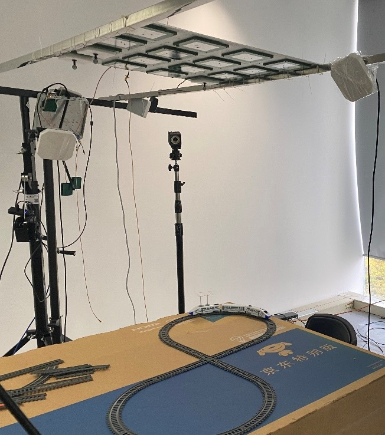
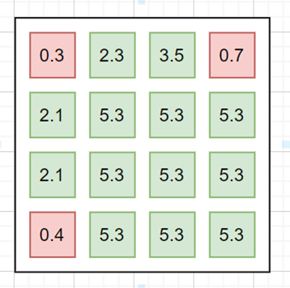
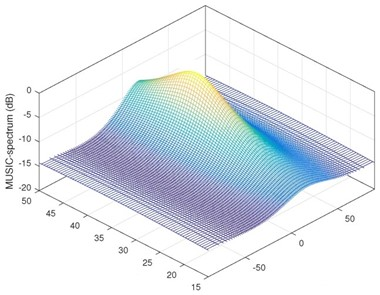
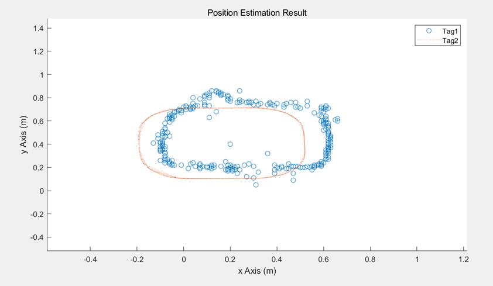

# LRT-Visualization

## 1. Brief introduction of antenna array localization demo

Several tags are located by an antenna array with 16 antenna elements as shown in the picture.



You will get information by `*.json` file and show the information on the interface according to requirements as follows.

## 2. Data format

```python
{
    "time": us
    "tag": i
    "phase": [phase0, phase1,..., phase15],
    "rss": [rss0, rss1, ..., rss15],
    "spectrum": [[a0_0,a0_1,..a0_199],[a1_0,a1_1,...,a1_199], ..., [a199_0, a199_1, ..., a199_199]],
    "pos": [x,y]
}
```

the python dictionary is converted to JSON data. Each element in the dictionary is as follows:

- `"time": us`

  The value of `"time"` is an integer. It denotes the timestamp of the data.

- `"tag": i`

  The value of `"tag"` is an integer. It denotes the serial number of a tag, may be 1,2,3,4,....... 

- `"phase": [phase0, phase1,..., phase15]`

  The value of `"phase"` is an `1-D array` and the shape is (16, ). Each element in the array denotes the phase of one ANTENNA ELEMENT. The type of element is `float`.

- `"rss": [rss0, rss1, ..., rss15]`

  The value of `"rss"`  is an `1-D array` and the shape is (16, ).  Each element in the array denotes the rss of one ANTENNA ELEMENT. The type of element is `float`.

- `"spectrum": [[a0_0,a0_1,..a0_199],[a1_0,a1_1,...,a1_199], ..., [a199_0, a199_1, ..., a199_199]]`

  The value of `"spectrum"` is an `2-D array` and the shape is (200,200). The type of element is `float`.

- `"pos": [x,y]`

  The value of  `"pos"` is an `1-D array`. `x` denotes the x-coordinate of the position. `y` denotes the y-coordinate of the position.

Each JSON data will be saved as a separate file. The folder will be organized as follows:

```
data
  - t1.json
  - t2.json
  - t3.json
  .
  .
  .
```


## 3. Requirement for each part of the interface

The explanations and pictures are meant to give you straightforward description for the different 4 parts of information, and it would be great if you add your own creativity and ideas to make it fancy and eye-catching.

### 3.1 Phase Plot

#### Filter

- Tag filter: choose which tag related to the information to show on the chart

- Antenna element filter: choose which antenna element related to the information to show on the chart

#### Figure

keep the latest K (e.g. 2000) numbers of latest phase values of the corresponding one antenna element (or multiple antenna elements) and plotting them in time series.


### 3.2 RSS Estimate

#### Filter

- Tag filter: choose which tag related to the information to show on the chart

#### Figure

16 squares indicate 16 different antenna elements in the array, with red/green color indicates bad or good RSS status (with color bar) respectively and show the value of RSS on these colorful squares.



### 3.3 Spectrum Plot

#### Filter

- Tag filter: choose which tag related to the information to show on the chart

#### Figure

Scatter the value of spatial spectrum on the corresponding plane based on grids. Plot at 1 time/second. 



### 3.4 Localization Plot

#### Filter

- Tag filter: choose which tag related to the information to show on the chart
- Position Range: adjust the `xlim` and `ylim` of the localization plot figure.

#### Figure

Plot position on a 2D/3D grid keeping the latest M points (e.g. M=100). Position are (x,y) lists.

